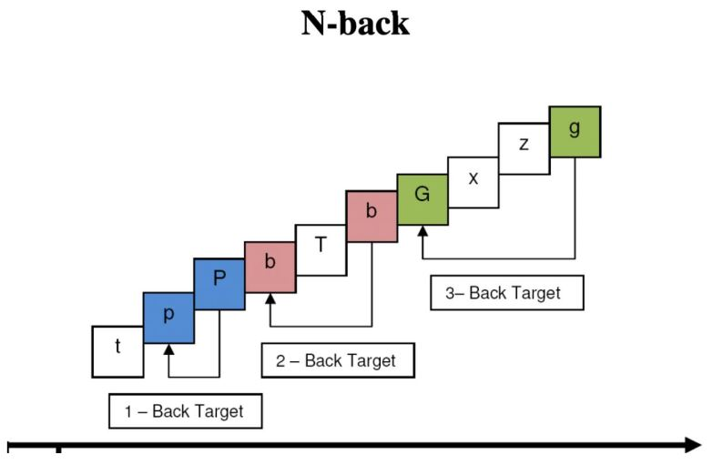

# 2-back_task_matlab
2-back task with Matlab

# Introduction
The n-back task is a performance task that is commonly used as an assessment in psychology
and cognitive neuroscience to measure a part of working memory and working memory
capacity. The N-Back task goes back more than half a century, developed in the 1950s by Kirchner.

In short, in the N-Back task, participants are presented a sequence of stimuli one-by-one. For each
stimulus, they need to decide if the current stimulus is the same as the one presented N trials ago.

The N can be 1 trials, 2 trials, 3 trials, etc. The higher the number, the more difficult the task. The
factors that seem to influence the performance are not only the N, but also the speed of presentation
and the size of the set of stimuli.

In a typical experiment, you see that letters are presented for 500 ms followed by a 2500 ms black
period. This timing seems to be used in lots of N-back studies (e.g., Kane & Conway, 2007).

There are different types of responses, you can see more in the above [pdf file](./2-back_task.pdf).

# A schema of the N-back task:

  

### The detail of the task
• This is a 2-back task.  
• The total stimulus set is 15 stimuli (letters).  
• Each stimulus is presented for 500 milliseconds.  
• Participants respond in a self-paced manner (i.e., participants are not forced to choose within
a limited time).  
• They should respond with type ‘y’ letter as yes, and ‘n’ letter as no.  
• The letter is removed from the screen, and a new stimulus is presented after 500 milliseconds.  
• The letters A, B, C, D, E, G, I, K, L, M, O, P, T, X, and Z should be used.  
• The letters should be presented in a random order.  
• There is 1 block of 50 trials.  
• Detailed feedback is given to the participants: ‘correct’, ‘wrong‘.  

### The expected result
Your code must save the data of each participant as a .mat file and print the following information
in the Command Window, at the end of the task.

• There were 50 trials in total in this task  
• Total trials that had a match: ?  
• Total trials that had not a match: ?  
• Number of correctly matched items: ?  
• Number of false alarms: ? 
• Percentage correct matches; ?%  
• Percentage false alarms: ?%  

# Running
You can run the code via the above [m file](./2-back_task.m)

# Acknowledgments

**Reference:**
https://www.psytoolkit.org/experiment-library/nback2.html

**Demo:**
https://www.psytoolkit.org/experiment-library/experiment_nback2.html

# Author

**Developed** by [Farrokh Karimi](https://farrokhkarimi.github.io/)
